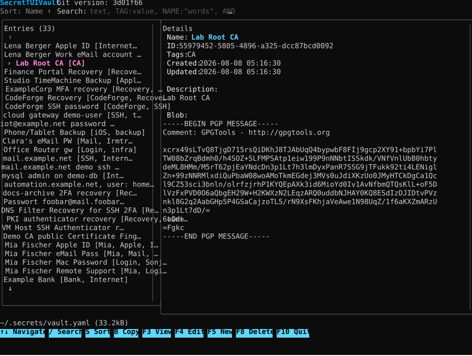

# SecretTUIVault
SecretTUIVault is a lightweight, offline terminal user interface for organizing opaque text blobs such as externally generated ASCII-armored GPG messages. Metadata stays readable and searchable; blob content is stored in one human-readable YAML file with text line endings normalized to LF.

<a href="https://raw.githubusercontent.com/tseiman/SecretTUIVault/main/ScreenShot_SecretTUIVault.svg">
  
</a>


> [!IMPORTANT]
> SecretTUIVault never encrypts blob content. Encryption remains external. New and edited blobs normalize CRLF and CR line endings to LF. On explicit request with `D`, it passes the selected blob with the same safe line-ending normalization to a local GnuPG 2.x process for temporary, view-only decryption. GnuPG Agent and Pinentry alone handle passphrases; SecretTUIVault never requests, receives, or stores them. Names, descriptions, and tags are stored in plaintext and must not contain passwords, PINs, recovery answers, or other secret material.

## Features

- Single, Git-friendly YAML vault
- Split list/detail view with light parameter labels, a cyan selected-name value, and directional overflow indicators
- Create, view, edit, and delete entries
- Stable random UUIDv4 identifiers
- Case-insensitive canonical tags with an A-Z/Z-A tag-picker view
- Name sorting in ascending or descending order
- Fuzzy metadata search with field filters, quoted terms, OR, and AND
- Conflict prompt before overwriting an externally changed vault
- Atomic saves, one previous-version backup, and restrictive Unix permissions
- No server, database, runtime network access, or telemetry; optional local clipboard copy and explicit local GPG decryption
- Builds for Linux, macOS, and Windows

## Requirements

- Go 1.26 or newer to build from source
- A UTF-8 terminal with color and function-key support
- GnuPG 2.x is optional and only required for `D` decryption; `gpg` must be available on `PATH` with a working GPG Agent and Pinentry setup
- Clipboard copy on Linux/Unix needs `wl-clipboard` (`wl-copy`/`wl-paste`) on Wayland or `xclip`/`xsel` on X11. macOS and Windows need no additional clipboard package.

## Installation from source

```console
git clone git@github.com:tseiman/SecretTUIVault.git
cd SecretTUIVault
make build
```

Install the binary somewhere on your `PATH`, for example on Linux or macOS:

```console
install -m 0755 secretvault "$HOME/.local/bin/secretvault"
```

PowerShell example for Windows:

```powershell
New-Item -ItemType Directory -Force "$HOME\bin" | Out-Null
Copy-Item .\secretvault.exe "$HOME\bin\secretvault.exe"
```

## Cross-platform builds

Build all supported output variants into `dist/`:

```console
make cross-build
```

This produces binaries for:

- Linux: `amd64`, `arm64`
- macOS: `amd64`, `arm64`
- Windows: `amd64`, `arm64`

`make build` and `make cross-build` embed the exact Git tag when `HEAD` is tagged; otherwise they embed the short commit hash. The TUI shows it as `Git version: <tag-or-hash>`. A direct `go build` can recover the VCS hash from Go build information but cannot infer a local Git tag reliably.

Build and verify the current platform:

```console
make check
make build
```

## Usage

Start with the default vault:

```console
secretvault
```

The default path is `~/.secrets/vault.yaml`. Select another file with:

```console
secretvault --vault /path/to/vault.yaml
```

Other CLI options:

```console
secretvault --help
secretvault --version
```

The parent directory and vault file are created on the first save. On Unix-like systems, directories created by SecretTUIVault use mode `0700`; existing caller-owned parent directories are never chmodded. Vault and backup files use mode `0600`. Symbolic links in any vault path component are rejected.

The bottom status line shows the YAML path, current on-disk size, and status message, for example `~/.secrets/vault.yaml (32kB)  Saved`. Paths below the current home directory use `~`; sizes automatically use `B`, `kB`, or `MB`.

## Keyboard controls

- `↑` / `↓`: select an entry
- `/`: focus search
- `Enter` or `F3`: open the complete selected entry in a view up to 80 columns wide
- `B` in the main or F3 view: copy the exact selected blob to the operating-system clipboard. Success is reported in the status line. If clipboard access fails, a borderless blob-only view opens for manual selection; `B`, `Esc`, or `Enter` returns to the previous view.
- `D` in the main or F3 view: normalize CRLF and CR line endings to LF, pass the selected blob to `gpg --decrypt` through standard input, and show the text result in a scrollable, view-only modal. A failure remains visible until `Esc` or `Enter` closes it. GPG Agent/Pinentry handles any passphrase prompt. `Esc` cancels a running operation; `Esc` or `Enter` closes a result.
- `F4`: edit the selected entry
- `F5`: create an entry
- `F8`: open deletion confirmation; only `Y` deletes, while `N` or `Esc` cancels (`Enter` does nothing)
- `F10`: quit; unsaved forms require explicit confirmation
- `Esc`, then `3` / `4` / `5` / `8` / `0`: alternatives for `F3` / `F4` / `F5` / `F8` / `F10` (Midnight Commander style)
- `S`: switch the `Sort: Name ↑` / `Sort: Name ↓` indicator before the search field between name A–Z and Z–A; this UI state is not stored in the vault YAML
- `Tab` / `Shift+Tab`: move between form fields
- `Ctrl+U`: clear the currently focused New/Edit field
- `Ctrl+R`: restore the focused field to its value when the form was opened; in New mode this restores an empty field
- `Ctrl+T`: choose existing tags or create a new tag while editing; the picker starts A-Z and `S` switches between A-Z and Z-A without changing stored tag order
- `Ctrl+S`: save a form
- `Esc`: close or cancel the current view/dialog

The `Entries` panel always reserves an `↑` line above and a `↓` line below its visible rows. An arrow is gray at the corresponding boundary and turns cyan when additional entries exist beyond that edge.

All available keyboard actions are rendered as individual bold, true-black-on-cyan blocks in the main footer and in view, edit, create, tag, delete, conflict, decryption, and confirmation screens. Terminal bracketed paste can be used in multiline description and blob fields. SecretTUIVault writes to the operating-system clipboard only when `B` is pressed; it never reads clipboard content.

On Linux/Unix, a missing or unusable `wl-copy`, `xclip`, or `xsel` command is reported after returning from the automatic borderless fallback view. Install the clipboard utility appropriate for the active desktop session and ensure its display environment (`WAYLAND_DISPLAY` or `DISPLAY`) is available.

## Search language

Search covers `name`, `description`, and `tags`, but never blob content. Matching is case-insensitive and fuzzy.

- Plain terms search all metadata fields: `database linux`
- Adjacent terms are OR alternatives: `Vater Windows`
- `TAG:` searches only tags: `TAG:Linux`
- `NAME:` searches only names: `NAME:username`
- Quotes preserve spaces: `NAME:"Login Database Server"`
- Explicit `AND` requires both neighboring expressions: `TAG:Vater AND TAG:Windows`
- `AND` has higher precedence than implicit OR: `TAG:Ops linux AND NAME:server`

Malformed quotes, empty field terms, or misplaced `AND` are reported without replacing the previous result list.

## Entry fields

- `id`: generated UUIDv4; stable and not editable
- `name`: required plaintext display name
- `description`: optional plaintext context; never put secret material here
- `tags`: optional plaintext grouping labels
- `created`: local creation time as `YYYY-MM-DD hh:mm:ss`
- `updated`: local last-edit time in the same format
- `blob`: opaque text stored without content or GPG validation

Example containing only non-secret placeholder data:

```yaml
version: 1
entries:
  - id: 550e8400-e29b-41d4-a716-446655440000
    name: Example recovery material
    description: Placeholder metadata for documentation only.
    tags:
      - Example
      - Recovery
    created: "2026-08-08 12:00:00"
    updated: "2026-08-08 12:00:00"
    blob: |-
      [ENCRYPTED OR OTHERWISE OPAQUE TEXT GOES HERE]
```

## Saving, conflicts, and recovery

SecretTUIVault remembers the exact file content loaded from disk. If another program or Git operation changes the vault before a save, a modal prompt offers:

- **Overwrite** (`O`): replace the current on-disk content with the pending TUI state
- **Cancel** (`Enter`, `Esc`, or `C`): preserve the external file and abandon that save; cancellation is the safe default

Normal saves use a temporary file in the same directory, synchronize it, atomically replace the vault, retain the previous bytes as `vault.yaml.bak`, and synchronize the directory where the platform supports it. A failed pre-commit save does not rotate away the last useful backup. Only one backup generation is retained.

To recover the previous version, exit SecretTUIVault first, inspect both files, and then replace the vault manually. Example:

```console
cp --preserve=mode ~/.secrets/vault.yaml.bak ~/.secrets/vault.yaml
```

The YAML file is intentionally readable and diff-friendly, but edit it carefully while the TUI is open: an external edit triggers the conflict prompt on the next save.

## Security model and limitations

- Encryption is entirely the user's responsibility.
- Metadata and tags are plaintext.
- Blob content is opaque; plaintext is accepted if supplied.
- Pressing `B` sends the exact blob to the operating-system clipboard. Clipboard managers, history, synchronization, and other applications may retain or read it; use this feature only when that exposure is acceptable.
- Pressing `D` starts `gpg --batch --no-tty --pinentry-mode ask --status-fd 2 --decrypt` directly without a shell and supplies the blob through standard input after normalizing CRLF and CR line endings to LF. No passphrase option or loopback Pinentry mode is used.
- Decrypted text is kept only in memory for the temporary view, is never written to YAML or automatically copied, and is discarded from the UI model when the view closes. Output is limited to 8 MiB; binary or non-UTF-8 plaintext is rejected.
- Signature state reported by GPG is shown as `none`, `valid`, `invalid`, or `unverified` above the decrypted text. Invalid or unverifiable signatures are warnings and are not silently presented as valid.
- The complete selected blob is displayed in the terminal.
- Shell history, terminal scrollback, screenshots, backups, Git history, and filesystem copies remain outside the application's control.
- A backup contains the complete previous vault and needs the same protection.
- This is a local, single-user application; it provides conflict detection, not collaborative merge or synchronization.
- Runtime behavior remains offline; optional decryption only starts the local `gpg` process and its configured GPG Agent/Pinentry. Go modules and CI need network access only while building.
- Vault input is limited to 64 MiB to avoid unbounded memory use from malformed local files.

## Development

```console
go test ./...
go test -race ./...
go vet ./...
make fmt-check
make cross-build
```

The repository's GitHub Actions workflow runs tests and `go vet` on Linux, macOS, and Windows, runs the race detector on Linux, verifies formatting, and compiles all documented targets.

## License

MIT — see [LICENSE](LICENSE).
